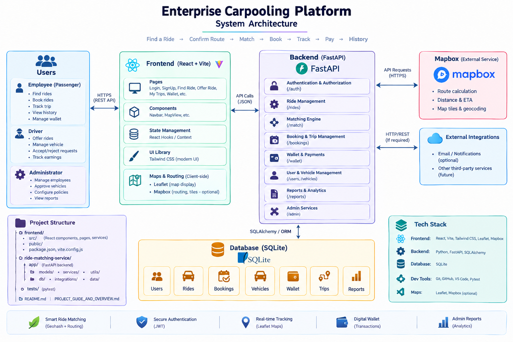

<div align="center">

# 🚗 Enterprise Carpooling Platform

### AI-Assisted Intelligent Ride Matching for Organizational Commuting

**A full-stack carpooling platform that lets employees of a registered organization find rides, offer rides, track trips live, pay through an in-app wallet, and lets admins manage the whole operation — powered by a custom geohash-based ride matching engine.**

<br>


-000000?style=flat-square&logo=mapbox&logoColor=white)


<br>

**Find a Ride → Confirm Route → Match → Book → Track → Pay → History**

</div>

---

## 📑 Table of Contents

- [🚜 About the Project](#-about-the-project)
- [🎯 Problem Statement](#-problem-statement)
- [👥 User Roles](#-user-roles)
- [✨ Features Implemented](#-features-implemented)
- [🏗️ System Architecture](#️-system-architecture)
- [🔄 End-to-End Workflow](#-end-to-end-workflow)
- [🧭 Intelligent Ride Matching Engine](#-intelligent-ride-matching-engine)
- [🌐 What is Geohashing, and Why We Use It](#-what-is-geohashing-and-why-we-use-it)
- [⚙️ The 6-Stage Matching Pipeline](#️-the-6-stage-matching-pipeline)
- [📐 Match Scoring Formula](#-match-scoring-formula)
- [🗺️ Routing Integration (Mapbox / Fallback)](#️-routing-integration-mapbox--fallback)
- [📂 Project Structure](#-project-structure)
- [⚙️ Technology Stack](#️-technology-stack)
- [🗃️ Database Design](#️-database-design)
- [▶️ Installation & Running](#️-installation--running)
- [🔗 API Reference](#-api-reference)
- [🧪 Testing](#-testing)
- [⚠️ Known Limitations](#️-known-limitations)
- [🗺️ Roadmap](#️-roadmap)
- [📌 Project Status](#-project-status)
- [📜 License](#-license)

---

# 🚜 About the Project

**Enterprise Carpooling Platform** is a full-stack hackathon project that solves organizational commuting through a shared-ride model. Employees of a registered company log in, and can either **search for a ride** as a passenger or **publish a ride** as a driver. Behind the scenes, a purpose-built **geohash + precise-routing matching engine** ranks every available ride against a passenger's request in milliseconds — without scanning the entire ride database.

The system is split into two independently runnable services:

- **`frontend/`** — a React + Vite single-page app (dark glassmorphism UI, Leaflet maps)
- **`ride-matching-service/`** — a FastAPI backend that owns authentication, rides, bookings, wallet, admin, reports, **and** the matching algorithm

---

# 🎯 Problem Statement

> Daily commuting is a significant challenge for employees, often leading to increased transportation costs, traffic congestion, fuel consumption, and environmental impact. Many employees travel along similar routes and schedules but lack an efficient way to coordinate shared transportation.

The goal: build an **Enterprise Carpooling Platform** that lets employees from a registered organization discover and share rides — covering ride discovery, ride publishing, route confirmation, booking, live trip tracking, payments, ride history, and reporting, with a **Company Administrator** managing employees, vehicles, and organization-wide settings.

```text
Employee logs in
       │
       ├── Find a Ride  → search → match → book → track → pay → history
       │
       └── Offer a Ride → register vehicle → publish route → accept/reject requests
```

---

# 👥 User Roles

### Company Administrator
Manages organization-wide data only — **not** involved in day-to-day ride operations.
- Approve/revoke employee platform access
- Approve/deactivate registered vehicles
- Configure fuel cost, travel cost per km, and default carpooling policy

### Employee
A single employee can act as **both** driver and passenger — these are activities, not separate roles.
- Register/manage vehicles
- Publish rides (offer) or search rides (find)
- Accept/reject booking requests as a driver
- Live-track trips, chat/call, pay via wallet/UPI/card/cash
- View ride history and personal reports

---

# ✨ Features Implemented

| Module | Status | Notes |
|---|:---:|---|
| Authentication (Login/Register) | ✅ | Email + password, quick-demo login buttons |
| Find a Ride | ✅ | Preset locations, date/time/seats/budget filters |
| Route Confirmation | ✅ | Shown before triggering the match algorithm |
| **Intelligent Ride Matching** | ✅ | Geohash spatial index + weighted multi-attribute scoring |
| Offer a Ride | ✅ | Requires an approved vehicle first |
| Ride Booking | ✅ | Duplicate-request and overbooking prevention |
| Driver Accept/Reject Workflow | ✅ | Seats deducted only on acceptance |
| Trip Management | ✅ | requested → accepted → started → completed lifecycle |
| Live Trip Tracking | ✅ | Leaflet map with simulated live driver marker |
| Chat / Voice Call | ✅ (simulated) | In-trip communication modal |
| Wallet & Payments | ✅ | Wallet / UPI / Card / Cash, recharge flow |
| Ride History | ✅ | Completed trips list |
| Vehicle Management | ✅ | Register, list, capacity |
| Saved Places | ✅ | Save frequent pickup/drop locations |
| Reports & Analytics | ✅ | Fuel savings, CO₂ reduction, department breakdown |
| Company Administration | ✅ | Employees, vehicles, org settings tabs |
| Real routing via Mapbox | ✅ (optional) | Falls back to straight-line math with no API key |

---

# 🏗️ System Architecture

> 📌 *Architecture diagram placeholder — replace this line with:*
> 

```text
                        ┌─────────────────────────┐
                        │   React Frontend (Vite) │
                        │  Find Ride / Offer Ride │
                        │  My Trips / Wallet /    │
                        │  Admin / Reports        │
                        └────────────┬────────────┘
                                     │ REST (fetch)
                                     ▼
                        ┌─────────────────────────┐
                        │      FastAPI Backend     │
                        │   app/main.py (routes)   │
                        └────────────┬────────────┘
                                     │
          ┌──────────────────────────┼──────────────────────────┐
          ▼                          ▼                          ▼
 ┌─────────────────┐      ┌────────────────────┐     ┌──────────────────┐
 │  SQLite Database │     │ RideMatchingService│     │Mapbox Client     │
 │ users, vehicles, │     │  (orchestrator)    │     |(optional live     │
 │ rides, bookings, │     └──────────┬─────────┘     | traffic routing)  │
 │ wallets, places  │                │              └──────────────────┘
 └─────────────────┘                 ▼
                          ┌───────────────────────────┐
                          │  SpatialIndexService       │  ← Geohash cell lookup
                          │  RideCandidateService      │  ← Hard filters + cap
                          │  RouteCompatibilityService │  ← Precise distance/detour
                          │  MatchScoringService       │  ← Weighted 0–100 score
                          └───────────────────────────┘
```

The matching engine lives entirely inside `ride-matching-service/` and is deliberately decoupled from the CRUD layer — `main.py` only ever talks to `RideMatchingService.match()`.

---

# 🔄 End-to-End Workflow

1. User launches the app → splash screen → login/register.
2. User picks **Find a Ride** or **Offer a Ride**.
3. The app shows the calculated route for confirmation.
4. Depending on the choice:
   - **Find**: the matching engine returns ranked candidates → user books one.
   - **Offer**: the ride is published and geohash-indexed instantly.
5. Booked rides appear under **My Trips**; the driver accepts or rejects each request.
6. During the trip, both sides use **Live Tracking** and **Chat/Call**.
7. After completion, the passenger pays via **Wallet/UPI/Card/Cash**.
8. The trip moves into **Ride History** and feeds the **Reports** dashboard.

---

# 🧭 Intelligent Ride Matching Engine

This is the core differentiator of the project — instead of comparing a passenger's request against every ride in the system, the engine uses a **two-stage retrieval-then-rank pipeline**:

```text
Stage 1 — CHEAP, APPROXIMATE           Stage 2 — EXPENSIVE, PRECISE
────────────────────────────           ─────────────────────────────
Geohash cell lookup                    Haversine / point-to-route distance
O(1) dictionary reads                  Real detour calculation
Narrows 20,000 rides → ~100            Narrows ~100 → Top 10, fully scored
```

This is exactly what makes a **single match query run in ~11ms** even against a 20,000-ride dataset (benchmarked in `ride-matching-service/README.md`), because expensive geometry is only ever computed on a tiny, already-plausible candidate set.

---

# 🌐 What is Geohashing, and Why We Use It

**Geohashing** is a technique for encoding a `(latitude, longitude)` pair into a short string (a "geohash") that represents a rectangular cell on the Earth's surface. Points that are geographically close usually share a common string prefix — the longer the shared prefix, the smaller and closer the shared cell.

```text
encode(22.5726, 88.3639, precision=6)  →  "tuvz01"
```

We implemented geohashing **from scratch** (`app/utils/geohash_utils.py`) as a dependency-free, standard base-32 geohash algorithm — interoperable with any other geohash tool (geohash.org, PostGIS, etc.), with zero external libraries.

### Why geohash, and why *only* for candidate retrieval

Geohash cells are **rectangular**, and rectangle "closeness" is not the same as real-world distance:

- Two points can share a geohash prefix and still be kilometers apart across a diagonal.
- Two points can be genuinely close but fall into two *different* adjacent cells if they straddle a cell boundary.

So we never use geohash as the final "is this a good match" answer. It is used **purely to shrink the search space** — turning "compare against 20,000 rides" into "compare against the ~100 rides whose route happens to pass near this specific area," using nothing but dictionary lookups. The real decision (how far is the walk, how much extra driving is the detour) is answered afterward with actual geometry.

### How it's applied in this project

1. **Precision 6** is used → cells of roughly **1.2 km × 0.6 km**, tuned for urban/suburban carpooling (configurable in `app/config.py`; bump to 7 for dense cities, drop to 5 for rural/highway corridors).
2. **At ride-publish time**, a driver's `pickup → drop` straight-line route is sampled every **400 meters** (`ROUTE_SAMPLE_INTERVAL_M`) into a list of points, each of which is encoded into a geohash cell. The deduplicated set of cells (`route_geohashes`) is stored against the ride — this is effectively "which map tiles does this driver's route pass through."
3. Every cell is indexed in an in-memory dictionary: `cell_index: Map<GeohashCell, Set<RideId>>` inside `RideStore`.
4. **At search time**, the passenger's pickup and destination points are each encoded into a geohash cell, and we pull that cell **plus its 8 surrounding neighbor cells** (9 cells total, per point) — this neighbor search is what prevents missing a ride whose route is meters away but technically falls just across a cell boundary.
5. The union of ride IDs sitting in any of those 18 cells (9 for pickup + 9 for destination) becomes the **candidate pool** — a set lookup, not a table scan.

```text
Passenger pickup (22.584, 88.402)
        │
        ▼
  geohash("tuvz01") + 8 neighbors → 9 cells
        │
        ▼
  cell_index lookup → candidate ride IDs (dozens, not thousands)
```

Only *this* small candidate pool is passed downstream to hard filters and then real distance math — geohash never decides who wins, it only decides who gets considered.

---

# ⚙️ The 6-Stage Matching Pipeline

```text
1. Passenger Match Request
        │
        ▼
2. SpatialIndexService        → Geohash 9-cell neighborhood lookup (pickup + destination)
        │
        ▼
3. RideCandidateService       → Hard filters: tenant, active status, date, seats, ±1hr time window
                                 Capped at MAX_CANDIDATES (default 100)
        │
        ▼
4. RouteCompatibilityService  → Cheap straight-line pre-rank → precise math on top 20 only
                                 Pickup walk distance / dropoff walk distance / driver detour
        │
        ▼
5. MatchScoringService        → Weighted 0–100 score across 5 dimensions
        │
        ▼
6. RideMatchingService        → Deterministic ranking + tie-breaking → Top N (default 10)
```

**Hard filters** (must all pass before any distance math runs):
- `org_id` matches (tenant isolation)
- `status == "active"`
- `travel_date` matches exactly
- `available_seats >= requested seats`
- `|departure_hour − requested_hour| ≤ 1.0 hour`

**Deterministic tie-breaking**, in order: higher match score → smaller detour → smaller time difference → lower fare → alphabetical ride ID. This guarantees the same request always returns the same ranked order.

---

# 📐 Match Scoring Formula

Each candidate ride is scored 0–100 on five weighted dimensions:

| Component | Weight | Logic |
|---|---|---|
| **Pickup Proximity** | 30% | `100 × max(0, 1 − pickup_dist / 1.5 km)` |
| **Destination Proximity** | 25% | `100 × max(0, 1 − drop_dist / 2.0 km)` |
| **Driver Detour** | 20% | `100 × max(0, 1 − detour_dist / 3.0 km)` |
| **Time Alignment** | 15% | `100 × max(0, 1 − time_diff / 1.0 hr)` |
| **Fare Match** | 10% | 70 (neutral) if no budget set; else scaled penalty above budget |

All thresholds live in one place (`app/config.py`) so the whole policy can be tuned per deployment without touching business logic.

---

# 🗺️ Routing Integration (Mapbox / Fallback)

The engine defines a `RouteProvider` protocol so the routing backend is swappable with zero changes anywhere else:

- **No `MAPBOX_ACCESS_TOKEN` set** → `DefaultRouteProvider` uses straight-line interpolation + haversine math. Fully offline, zero external calls.
- **Token set** → `MapboxRouteProvider` calls the Mapbox Directions API (`driving-traffic` profile) for real road geometry and live-traffic ETAs, with in-process caching (`lru_cache`) so the same ride's route is never fetched twice per process — directly satisfying the "minimize external routing API calls" requirement. Detour is computed by comparing a routed `pickup → passenger_pickup → passenger_drop → drop` trip against the driver's base route, using **real roads**, not a straight line.

---

# 📂 Project Structure

```text
carpooling-platform/
│
├── frontend/
│   ├── src/
│   │   ├── App.jsx
│   │   ├── components/        # Navbar, MapView (Leaflet)
│   │   ├── pages/              # FindRide, OfferRide, MyTrips, Wallet,
│   │   │                        # Vehicles, RideHistory, SavedPlaces,
│   │   │                        # Reports, AdminDashboard, Login, SignUp
│   │   └── services/api.js     # Fetch wrapper for every backend endpoint
│   └── vite.config.js
│
└── ride-matching-service/
    ├── app/
    │   ├── main.py              # All FastAPI routes
    │   ├── config.py            # Every tunable threshold/weight
    │   ├── data/loader.py       # Ride dataclass + RideStore + geohash indexing
    │   ├── db/database.py       # SQLite schema + seed data
    │   ├── integrations/mapbox_client.py
    │   ├── models/schemas.py    # Pydantic request/response models
    │   ├── services/
    │   │   ├── spatial_index_service.py       # Geohash cell lookup only
    │   │   ├── ride_candidate_service.py      # Hard filters + candidate cap
    │   │   ├── route_compatibility_service.py # Precise distance/detour math
    │   │   ├── match_scoring_service.py       # Pure scoring functions
    │   │   └── ride_matching_service.py       # Orchestrator + ranking
    │   └── utils/
    │       ├── geohash_utils.py  # Dependency-free geohash encode/decode/neighbors
    │       └── geo_utils.py      # Haversine, interpolation, point-to-route distance
    └── tests/                    # 37 tests across every layer
```

---

# ⚙️ Technology Stack

| Category | Technology |
|---|---|
| Frontend | React 18, Vite, Tailwind (CDN), Lucide Icons |
| Maps | Leaflet + OpenStreetMap tiles |
| Backend | FastAPI, Pydantic |
| Database | SQLite (via `sqlite3`) |
| Spatial Indexing | Custom geohash implementation (no external geo library) |
| Optional Routing | Mapbox Directions API (`driving-traffic`) |
| Testing | Pytest, FastAPI `TestClient` |
| Data Loading (legacy path) | Pandas (CSV seeding) |

---

# 🗃️ Database Design

```text
users            → id, name, email, password_hash, role, department,
                    manager, office_location, platform_access, wallet_balance
vehicles         → id, user_id, driver_name, model, registration_number,
                    seating_capacity, status
rides            → id, driver_id, vehicle_id, org_id, pickup/drop (name+lat+lon),
                    travel_date, departure_hour, available_seats, fare_per_seat, status
bookings         → id, ride_id, passenger_id, seats_booked, status,
                    total_fare, payment_method, payment_status
saved_places     → id, user_id, name, address, latitude, longitude
company_settings → org_id, company_name, fuel_cost_per_liter,
                    travel_cost_per_km, default_policy
```

The in-memory `RideStore` (geohash cell index) is rebuilt from `rides` at startup and kept in sync on every publish/booking-accept, so the spatial index never drifts from the database.

---

# ▶️ Installation & Running

### 1. Backend

```bash
cd ride-matching-service
pip install -r requirements.txt --break-system-packages   # or use a venv

# optional: enable real routing
cp .env.example .env
# MAPBOX_ACCESS_TOKEN=pk.eyJ1I...

uvicorn app.main:app --reload --port 8000
```

Verify: `curl http://localhost:8000/health` → `{"status": "ok", "ridesLoaded": N}`
Swagger UI: `http://localhost:8000/docs`

### 2. Frontend

```bash
cd frontend
npm install
npm run dev
```

Frontend runs on `http://localhost:3000` and proxies `/api`, `/rides`, `/health` to the backend on port 8000 (see `vite.config.js`).

### Demo Logins

| Role | Email | Password |
|---|---|---|
| Driver/Employee | amit@org.com | user123 |
| Passenger/Employee | chanchal@org.com | user123 |
| Company Admin | admin@org.com | admin123 |

---

# 🔗 API Reference

| Method | Endpoint | Purpose |
|---|---|---|
| `GET` | `/health` | System health + rides loaded |
| `POST` | `/rides/match` | **Core matching endpoint** |
| `POST` | `/api/auth/register` / `/login` | Authentication |
| `GET`/`POST` | `/api/vehicles` | Vehicle management |
| `GET`/`POST` | `/api/rides` | List/publish rides |
| `POST` | `/api/rides/{id}/book` | Book a ride |
| `POST` | `/api/bookings/{id}/accept` \| `/reject` | Driver approval workflow |
| `GET` | `/api/rides/{id}/riders` | Show all riders on a ride |
| `GET` | `/api/trips` | User's trips (driver + passenger) |
| `PATCH` | `/api/trips/{id}/status` | Update trip lifecycle |
| `POST` | `/api/trips/{id}/pay` | Complete payment |
| `GET`/`POST` | `/api/wallet`, `/api/wallet/recharge` | Wallet operations |
| `GET`/`POST` | `/api/saved-places` | Saved locations |
| `GET`/`PATCH` | `/api/admin/employees`, `/api/admin/vehicles` | Admin controls |
| `GET`/`POST` | `/api/admin/settings` | Org configuration |
| `GET` | `/api/reports` | Analytics dashboard data |

---

# 🧪 Testing

```bash
cd ride-matching-service
python -m pytest tests/ -v
```

**37 tests** covering:
- Geohash encode/decode correctness, neighbor generation, boundary cases
- Tenant isolation, seat/status/date/time hard filters
- Scoring math for every weighted dimension
- End-to-end matching, empty results, zero-length routes
- Deterministic tie-breaking across repeated identical queries
- Mocked Mapbox provider (no real network calls needed to test routing logic)
- API + SQLite persistence (auth, booking accept/reject, overbooking prevention)

---

# ⚠️ Known Limitations

Being transparent about what's simplified for the hackathon scope, and what needs fixing next:

- **Admin routes have no authorization check yet** — any logged-in user can currently reach `/api/admin/*`. Planned fix: role-based guard middleware.
- **Matched ride fare is not returned by `/rides/match`** — the frontend currently shows a fixed placeholder fare on results instead of the real `fare_per_seat`.
- **Live tracking uses simulated coordinates**, not the ride's actual stored route, since bookings don't yet persist precise pickup/drop coordinates.
- **Single organization in practice** — multi-tenant scaffolding (`org_id`) exists in the matching engine, but the app currently seeds and defaults everything to one org.
- **Passwords stored in plaintext** — acceptable for a hackathon demo, not for production.
- Chat and voice call are UI simulations, not wired to a real messaging/telephony backend.
- "Recurring Ride" (mentioned in the problem statement's Find Ride requirements) is not yet implemented.

---

# 🗺️ Roadmap

- [ ] Role-based access control on admin endpoints
- [ ] Return real fare + vehicle info in match results
- [ ] Persist real pickup/drop coordinates per booking for accurate live tracking
- [ ] Ride cancellation flow (driver + passenger side)
- [ ] Password hashing (bcrypt/argon2)
- [ ] Push notifications for booking accept/reject
- [ ] True multi-tenant org onboarding flow
- [ ] Route optimization suggestions for drivers with multiple riders

---

# 📌 Project Status

| Component | Status |
|---|:---:|
| Authentication & Roles | 🟢 Implemented |
| Ride Discovery & Publishing | 🟢 Implemented |
| Geohash Spatial Matching Engine | 🟢 Implemented & Tested |
| Route Confirmation | 🟢 Implemented |
| Booking + Accept/Reject Workflow | 🟢 Implemented |
| Live Trip Tracking | 🟡 Simulated |
| Wallet & Payments | 🟢 Implemented (sandbox-style) |
| Vehicle Management | 🟢 Implemented |
| Ride History & Reports | 🟢 Implemented |
| Company Administration | 🟡 Implemented, needs authz |
| Mapbox Real Routing | 🟢 Optional, integrated |

---

# 📜 License

This project was developed as a hackathon submission for educational and prototype purposes. Third-party libraries and the Mapbox API remain subject to their respective licenses.

<div align="center">

### 🚗 Enterprise Carpooling Platform
**Ride Together. Save Together.**

</div>
